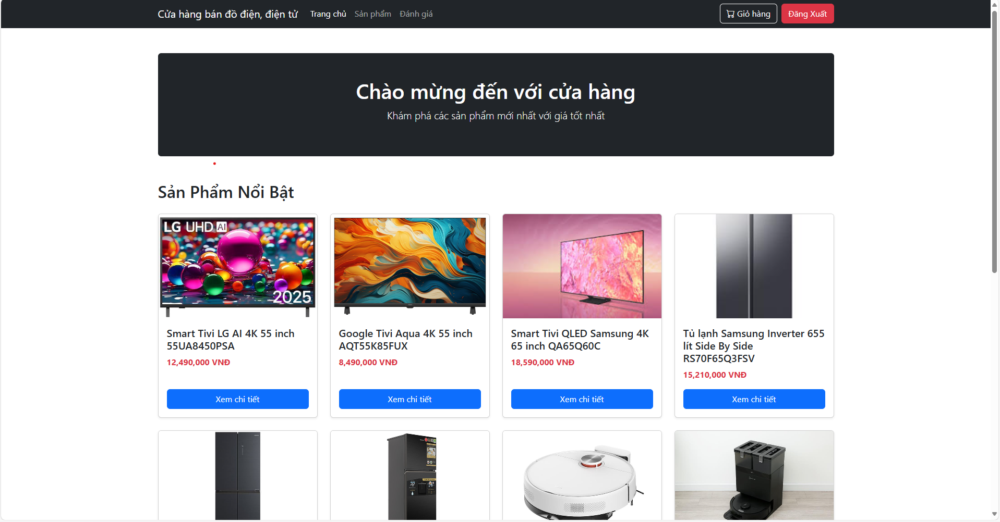
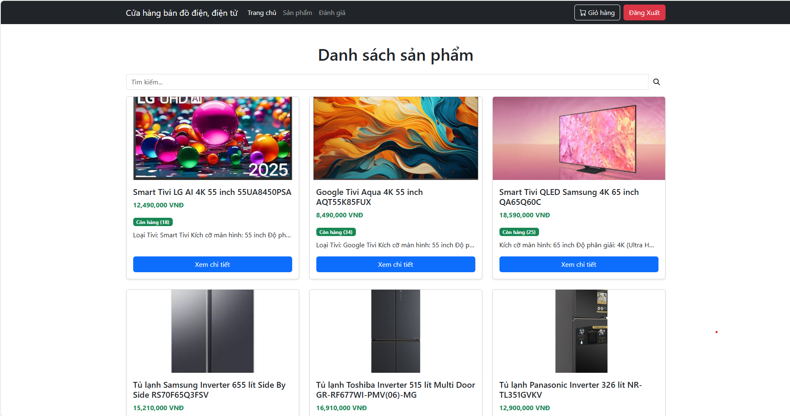
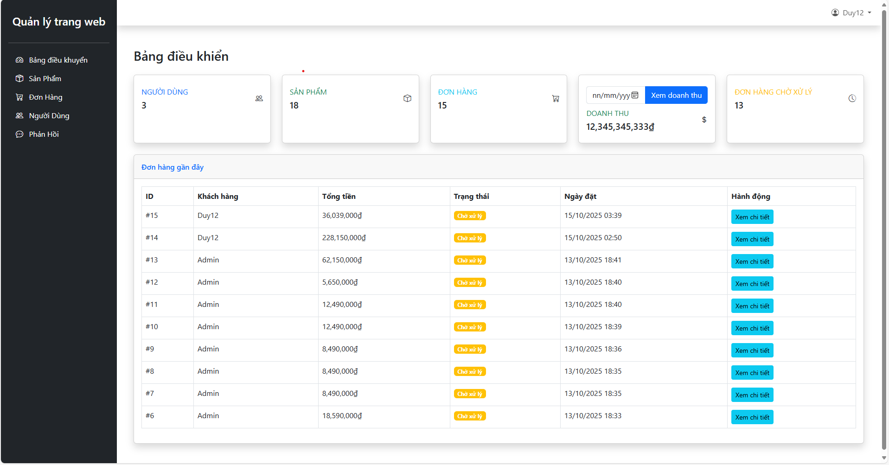

# ⚡ WEBSITE BÁN ĐỒ ĐIỆN – ĐIỆN TỬ

Dự án xây dựng website thương mại điện tử chuyên bán **đồ điện – điện tử**, phát triển bằng **Laravel**, **MySQL**, **Bootstrap**.

---

## 🗂️ CẤU TRÚC DỰ ÁN

```
project/
├── app/
│   ├── Http/
│   │   ├── Controllers/
│   │   └── Middleware/
│   ├── Models/
│   └── Providers/
├── resources/
│   ├── views/         # Giao diện Blade
│   ├── css/
│   └── js/
├── routes/
│   └── web.php
├── public/
│   ├── images/
│   └── uploads/
└── database/
    └── migrations/
```

---

## ⚙️ CÀI ĐẶT VÀ CHẠY DỰ ÁN

### ✅ Bước 1: Clone dự án

```bash
git clone https://github.com/Duy4104/ktpm.git
cd ktpm
```

### ✅ Bước 2: Cài đặt dependencies

```bash
composer install
npm install && npm run dev
```

### ✅ Bước 3: Cấu hình môi trường

```bash
cp .env.example .env
php artisan key:generate
```

Mở file `.env` và cấu hình thông tin kết nối MySQL:

```env
DB_DATABASE=k2
DB_USERNAME=root
DB_PASSWORD=
```

### ✅ Bước 4: Tạo cơ sở dữ liệu và seed dữ liệu mẫu

```bash
php artisan migrate --seed
```

### ✅ Bước 5: Chạy server

```bash
php artisan serve
```

> Truy cập tại: [http://localhost:8000](http://localhost:8000)

---

## 🖼️ GIAO DIỆN 

### Trang chủ
<p align="center">
  
</p>

### Trang sản phẩm
<p align="center">
  
</p>

### Trang quản trị
<p align="center">
  
</p>

---


## 👨‍💻 NHÓM PHÁT TRIỂN

| Họ và tên | MSV|
|------------|----------|
| **Trần Văn Duy** | 23015552 |
| **Hoàng Mạnh Dũng** | 23014015|

---

## 📄 GIẤY PHÉP & MỤC ĐÍCH

Dự án được xây dựng phục vụ **môn học Kỹ nghệ phần mềm**,  
nhằm mục đích học tập và nghiên cứu,

---
---

## 🧩 UML TỔNG QUÁT

Sơ đồ UML tổng quát mô tả cấu trúc chính của hệ thống website bán đồ điện - điện tử, bao gồm các thành phần như **User**, **Product**, **Review**, **Order**, và **Feedback**, cùng các mối quan hệ giữa chúng.

<p align="center">
  
</p>


## 📬 LIÊN HỆ

- **Email:** 23015552@st.phenikaa-uni.edu.vn  
- **GitHub:** [github.com/Duy4104](https://github.com/duy4104)

<p align="center">
  💡 *Cảm ơn bạn đã quan tâm đến dự án!*
</p>
